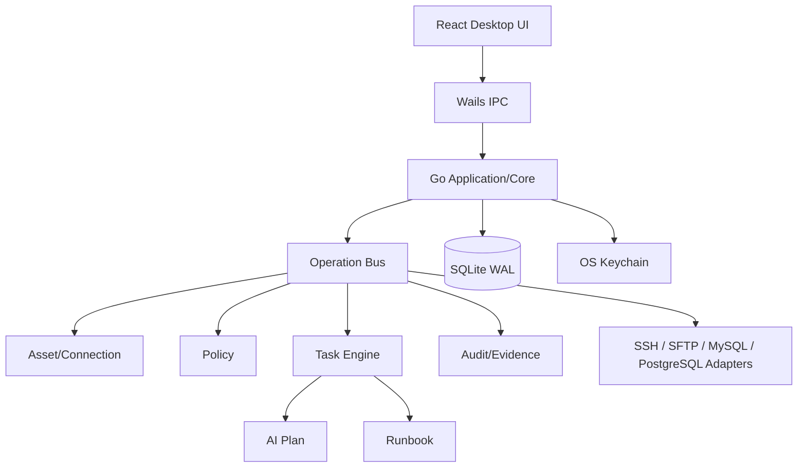

> 状态：已确认  
> 负责人：vvitem  
> 最后更新：2026-07-11  
> 基线 Commit：`b590887fea1e2c43e7831a48932b9be5d44ccfa3`  
> 关联 Milestone：`M4-beta`  
> 关联 Issue/PR：待创建

# 目标状态（To-Be）

## 六个月产品形态

一个 Windows 正式支持、macOS/Linux 社区预览的本地桌面应用，提供：

- SSH 资产、SSH Config 导入、主机指纹确认、终端和基础 SFTP。
- MySQL/PostgreSQL、SSH Tunnel、Schema 浏览、SQL 编辑、结果查看、Explain。
- 结构化 SSH/数据库只读诊断工具。
- `Goal → Plan → Approval → Execute → Verify → Report` 任务闭环。
- Operation Bus、Task Engine、Audit、Evidence、Runbook。
- SQLite WAL、本地加密和 OS Keychain。
- Windows 核心 E2E 与可重复 Beta 发布。

## 目标架构

## 目标安全属性

- 模型不能访问长期凭据。
- 远端日志、文件、SQL 结果始终按不可信数据处理。
- Plan 最多 8 步，执行不能扩大资产、工具和参数范围。
- AI 不存在任意 Shell、PowerShell、DML/DDL 能力。
- Secret Redaction 失败时阻止持久化和模型回传。
- 每一步支持超时、取消、稳定错误码和 Evidence。

## 目标交付属性

- Windows 安装包可重复构建。
- 核心场景有单元、集成和 E2E 证据。
- 无明文凭据进入日志、Prompt、报告和崩溃包。
- Beta 仅发布已验证协议，不因功能数量延期。
