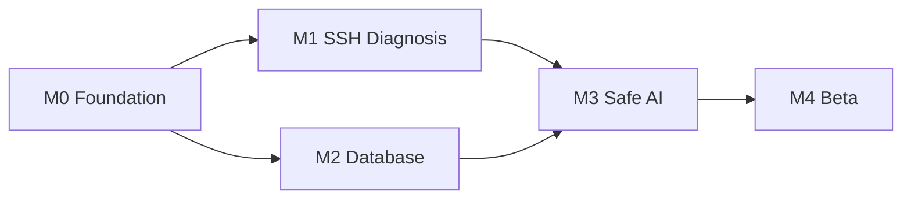

> 状态：已确认  
> 负责人：vvitem  
> 最后更新：2026-07-11  
> 基线 Commit：`b590887fea1e2c43e7831a48932b9be5d44ccfa3`  
> 关联 Milestone：`M0-foundation → M4-beta`  
> 关联 Issue/PR：待创建

# 六个月路线图

| Milestone | 周期 | 核心目标 | 退出条件 |
|---|---|---|---|
| `M0-foundation` | 第1–4周 | 工程骨架、资产、凭据、Operation Bus、审计、SSH 连接 | 可在 Windows 构建；添加 SSH 资产并通过统一执行边界完成只读连接测试 |
| `M1-ssh-diagnosis` | 第5–9周 | 终端、SFTP、SSH 只读诊断任务 | SSH-01…SSH-10 中至少8个通过集成测试，断线/取消状态明确 |
| `M2-database` | 第10–15周 | MySQL、PostgreSQL、SQL、Explain、数据库诊断 | DB-01…DB-10 中至少8个通过；DML/DDL 双层拒绝 |
| `M3-safe-ai` | 第16–20周 | AI Plan、Task Engine、Evidence、受约束执行 | Plan≤8步；重启恢复无未知状态；100% AI 工具经 Bus/Audit |
| `M4-beta` | 第21–24周 | Runbook、首次引导、Windows 硬化、公开 Beta | Beta 门禁通过，20个场景成功率≥70%，发布 v0.1.0-beta |

## 阶段依赖

## 资源分配

每周默认：50% 垂直功能、20% 测试/真机、15% 安全审查、10% 文档/社区、5% 技术债。任何新增协议都必须被拒绝或进入 Beta 后候选池。
