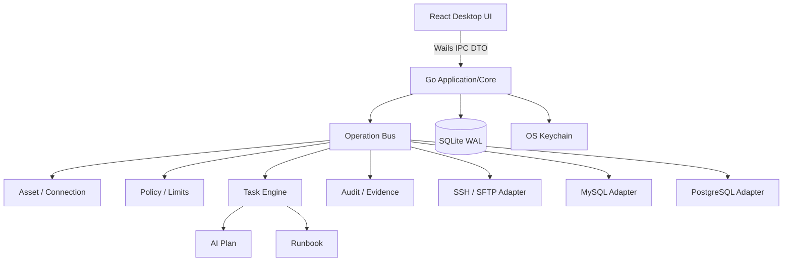

> 状态：已确认  
> 负责人：vvitem  
> 最后更新：2026-07-11  
> 基线 Commit：`b590887fea1e2c43e7831a48932b9be5d44ccfa3`  
> 关联 Milestone：`M0-foundation → M4-beta`  
> 关联 Issue/PR：待创建

# 后端总体架构

## 目标拓扑



## 核心约束

1. `Operation Bus` 是唯一执行入口。UI、AI、Runbook、未来 CLI/MCP 不得直接调用 Adapter。
2. Wails Binding 只负责 DTO 校验和委派，不承载业务规则。
3. Adapter 只实现协议能力，不决定用户权限、Plan Scope 或审计策略。
4. Task Engine 持久化任务和步骤状态，应用重启后不得留下未知状态。
5. 凭据以 `credential_ref` 传递，秘密只在最靠近连接建立处短暂解析。
6. Evidence 先脱敏再持久化；大对象以文件引用保存。

## 建议单仓结构

```text
/cmd/desktop                     # Wails 入口（建议路径）
/frontend                        # React/TypeScript（建议路径）
/internal/identity
/internal/asset
/internal/connection
/internal/operation
/internal/policy
/internal/task
/internal/audit
/internal/evidence
/internal/ai
/internal/runbook
/internal/ssh
/internal/sftp
/internal/database
/internal/security
/internal/storage
/migrations
/e2e
```

## 未来团队兼容

首版实体保留 `workspace_id`、`actor_id`、`device_id` 和版本字段；不得因此创建控制平面、账号服务、云同步或远程 API。未来边界只在 ADR 和 DTO Envelope 中定义。
