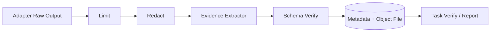

> 状态：已确认  
> 负责人：vvitem  
> 最后更新：2026-07-11  
> 基线 Commit：`b590887fea1e2c43e7831a48932b9be5d44ccfa3`  
> 关联 Milestone：`M0-foundation / M3-safe-ai`  
> 关联 Issue/PR：待创建

# 审计与证据

## 区别

- **Audit** 回答“谁在何时请求了什么、系统如何判断、结果状态是什么”。
- **Evidence** 回答“结论依据的可验证数据是什么”。

两者互相引用但不混存完整敏感输出。

## Audit Event

事件至少包含：`event_id`、`trace_id`、`workspace_id`、`actor_id`、`device_id`、`source`、`resource_id`、`capability`、`risk`、`policy_decision`、`request_hash`、`result_hash`、`error_code`、`prev_hash`、`created_at`。

事件类型：`operation.requested`、`operation.allowed/denied`、`operation.completed/failed/cancelled`、`task.state.changed`、`plan.approved/rejected`、`evidence.persisted/redaction_failed`、`credential.accessed`。

Audit 表 append-only；应用 API 不提供 Update/Delete。清理必须是独立、显式、受审计的维护操作。

## Evidence

Evidence 包含类型、结构化摘要、采集时间、资产、工具版本/模板 hash、完整性 hash、截断标记和可选对象引用。

## 敏感内容

- 默认不保存完整 SQL 结果或日志全文。
- UI 明确“保存为证据”时仍执行脱敏和限额。
- Object File 使用仅当前用户可读权限；文件名不含资产名或秘密。
- 导出报告默认引用摘要；用户主动导出原始证据需要再次确认。
