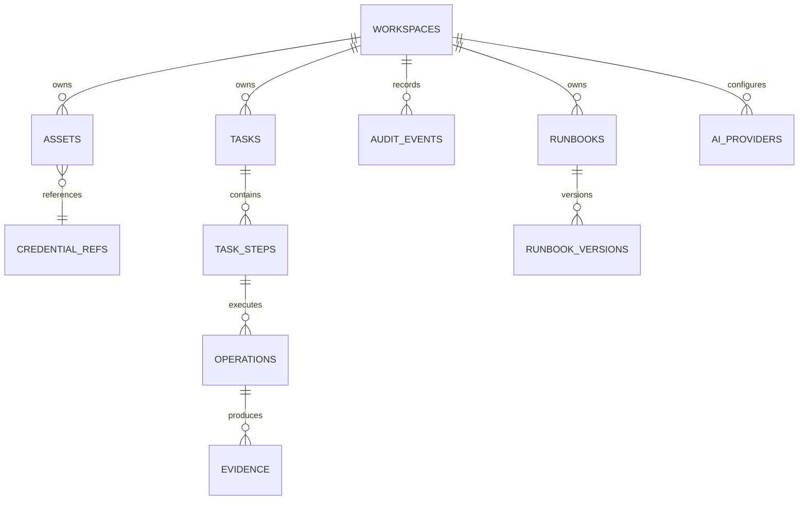

> 状态：已确认  
> 负责人：vvitem  
> 最后更新：2026-07-11  
> 基线 Commit：`b590887fea1e2c43e7831a48932b9be5d44ccfa3`  
> 关联 Milestone：`M0-foundation → M4-beta`  
> 关联 Issue/PR：待创建

# 数据模型

## 原则

- 本地 SQLite 使用 WAL、外键和显式 Migration。
- 主键建议使用 UUIDv7/ULID 字符串，便于未来同步；最终方案在 M0 ADR 补充。
- 所有业务表保留 `workspace_id`；执行事实保留 `actor_id`、`device_id`。
- JSON 只存版本化、低查询需求的参数快照；高频过滤字段必须拆列。
- 秘密绝不进入 SQLite，仅保存 Keychain 引用。

## 核心表

| 表 | 关键字段 | 索引/关系 | 敏感处理 |
|---|---|---|---|
| `workspaces` | id,name,created_at | name | 本地默认工作空间 |
| `assets` | id,workspace_id,type,name,environment,config_json,credential_ref_id,version,status | workspace/type/name | config 禁止秘密 |
| `credential_refs` | id,workspace_id,provider,key_name,metadata_json | provider/key_name unique | 只存引用 |
| `tasks` | id,workspace_id,actor_id,device_id,goal,status,plan_version,trace_id,timestamps | status/created_at/trace_id | goal 入库前脱敏 |
| `task_steps` | id,task_id,step_index,capability,params_json,status,attempt,timeout_ms,error_code | task/step unique | params 已规范化/脱敏 |
| `operations` | id,task_id,step_id,source,asset_id,capability,risk,idempotency_key,status,duration | trace/asset/time | 不存秘密 |
| `evidence` | id,operation_id,type,summary_json,object_ref,hash,size,redaction_profile | operation/type | 大对象文件加权限 |
| `audit_events` | id,workspace_id,trace_id,event_type,actor_id,device_id,resource_id,payload_hash,prev_hash,created_at | trace/time/actor | append-only |
| `runbooks` | id,workspace_id,name,current_version,status | workspace/name | 无秘密 |
| `runbook_versions` | id,runbook_id,version,plan_template_json,parameter_schema,created_at | runbook/version unique | 参数默认值不得含秘密 |
| `ai_providers` | id,workspace_id,name,type,endpoint,credential_ref_id,model,settings_json | workspace/name | API key 仅引用 |

## 关系

## 保留与清理

- Audit 默认长期保留，用户可导出后按明确操作清理。
- Evidence 大对象默认 30 天（待确认），元数据可更久。
- SQL 查询结果默认不长期保存；仅保存 hash、摘要和用户明确选择的 Evidence。
- 清理任务本身必须写 Audit。

## Migration

Migration 只追加不修改；每个迁移包含前置检查、事务策略、数据量评估和恢复说明。CI 必须验证 fresh install 与从上一版本升级。
