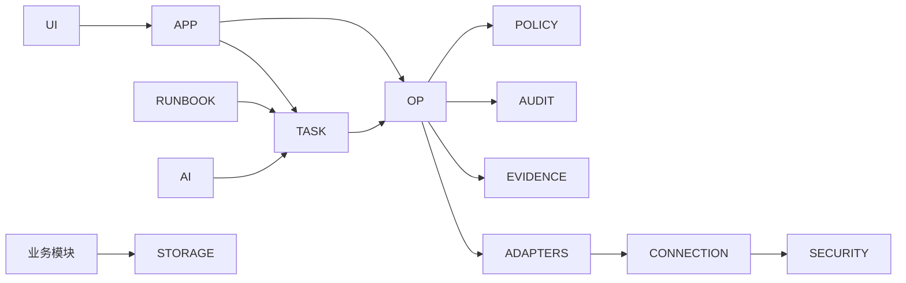

> 状态：已确认  
> 负责人：vvitem  
> 最后更新：2026-07-11  
> 基线 Commit：`b590887fea1e2c43e7831a48932b9be5d44ccfa3`  
> 关联 Milestone：`M0-foundation → M3-safe-ai`  
> 关联 Issue/PR：待创建

# 模块边界

> 以下均为目标设计；当前仓库尚无对应代码。代码路径标注“建议路径”。

| 模块 | 职责 | 输入/输出 | 核心接口 | 允许依赖 | 禁止依赖 | 持久化 | 错误边界 | 测试 | 建议路径 |
|---|---|---|---|---|---|---|---|---|---|
| `asset` | 资产配置、标签、环境、引用 | Asset DTO → Asset | `AssetRepository`, `AssetService` | identity, storage | adapter 实现 | `assets` | 校验/不存在 | repository/service | `internal/asset` |
| `connection` | 连接池、Tunnel、生命周期 | Asset+CredentialLease → Connection | `Connector`, `Lease` | asset, security | UI, AI | 可选会话元数据 | 网络/认证/TLS | fake+真实协议 | `internal/connection` |
| `operation` | 唯一执行编排 | `OperationRequest` → `OperationResult` | `Bus.Execute` | asset, policy, audit, evidence, adapters | frontend | `operations` | 稳定错误码 | pipeline/bypass | `internal/operation` |
| `policy` | 风险重算、Plan Scope、限制 | request+context → decision | `Evaluator` | 无或纯模型 | Adapter/DB | policy version | deny/confirm | table/fuzz | `internal/policy` |
| `task` | Task/Step 状态机与恢复 | Plan → TaskReport | `Engine.Start/Cancel/Resume` | operation, evidence | 协议客户端 | tasks/task_steps | transition/recovery | property/crash | `internal/task` |
| `audit` | append-only 事件 | Event → EventID | `Recorder.Append` | storage | AI Provider | audit_events | 持久化失败 fail-closed | repository/tamper | `internal/audit` |
| `evidence` | 证据校验、脱敏、对象引用 | raw → Evidence | `Store.Put`, `Contract.Verify` | security, storage | UI 直接写入 | evidence+files | redaction/size | golden/security | `internal/evidence` |
| `ai` | Provider、Plan、Report | Goal+context → Plan/Report | `Planner`, `Reporter` | task models, tool registry | credential resolver, adapters | ai_providers | provider/schema | mock/adversarial | `internal/ai` |
| `runbook` | Plan 模板、版本、参数化 | Runbook+params → Plan | `Repository`, `Compiler` | task schema | adapters | runbooks/versions | validation/version | schema/execution | `internal/runbook` |
| `database` | 方言、连接、结构化 DB 工具 | typed params → typed result | `Dialect`, `Tool` | connection, operation contracts | UI/AI | 无秘密 | DB_* errors | MySQL/PG | `internal/database` |
| `ssh` | SSH 会话和只读工具 | typed params → result | `Session`, `Tool` | connection, operation contracts | AI | 无秘密 | SSH_* errors | fake/real host | `internal/ssh` |
| `security` | Keychain、脱敏、Secret Lease | ref → short-lived secret | `CredentialStore`, `Redactor` | OS APIs | AI/UI persistence | credential_refs only | fail-closed | leak tests | `internal/security` |

## 依赖方向

跨模块调用优先通过接口和 DTO；禁止共享可变全局连接、秘密或 Task 状态。
