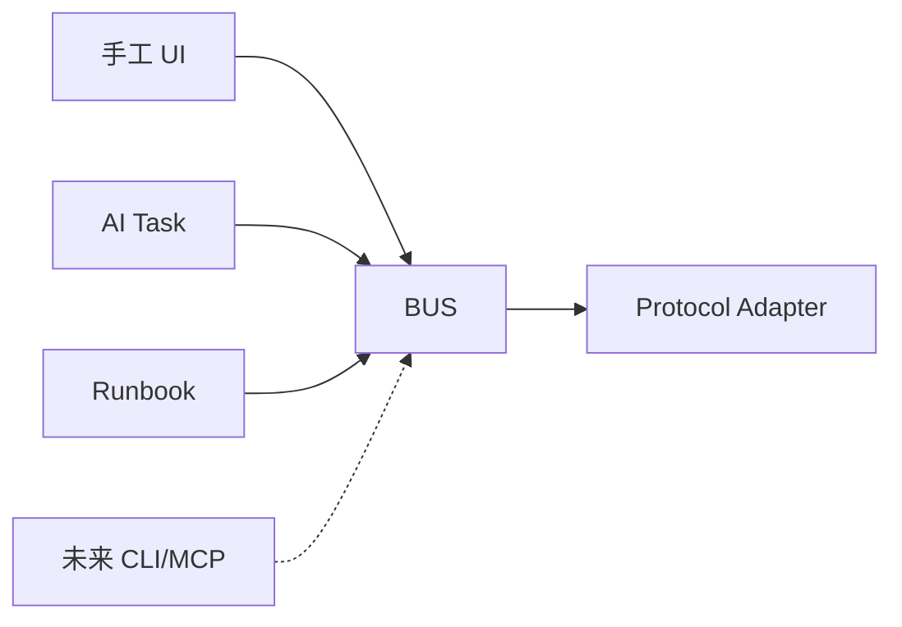

> 状态：已确认  
> 负责人：vvitem  
> 最后更新：2026-07-11  
> 基线 Commit：`b590887fea1e2c43e7831a48932b9be5d44ccfa3`  
> 关联 Milestone：`M0-foundation`  
> 关联 Issue/PR：待创建

# Operation Bus

## 目的

Operation Bus 是所有具有外部副作用或读取敏感资产数据的唯一边界。它统一执行参数校验、风险、Plan Scope、Policy、Audit、Evidence、超时、取消、输出限制和脱敏，避免 UI、AI 或 Runbook 各自实现不同安全逻辑。

## 接入方式



未来 CLI/MCP 只能成为新的 `Source`，不能直连 Adapter。

## OperationRequest（目标契约）

```go
type OperationRequest struct {
    OperationID   string
    WorkspaceID   string
    Actor         Actor
    Source        Source        // UI | AI | RUNBOOK | CLI | MCP
    DeviceID      string
    AssetID       string
    Capability    string        // e.g. log.tail
    Parameters    json.RawMessage
    Limits        ExecutionLimits
    ClaimedRisk   RiskLevel
    PlanID        string
    PlanVersion   int
    PlanStepID    string
    IdempotencyKey string
    TraceID       string
}
```

`ClaimedRisk` 仅用于对比，最终风险必须由本地 `policy` 重新计算。

## 执行流水线

```text
Validate
→ Resolve Asset
→ Resolve Credential Reference
→ Normalize Parameters
→ Recalculate Risk
→ Check Plan Scope
→ Apply Policy and Limits
→ Write Requested Audit Event
→ Execute Adapter
→ Enforce Output Limits
→ Redact Result
→ Persist Evidence
→ Write Completed/Failed Audit Event
→ Return Structured Result
```

## 关键规则

- Audit `requested` 写入失败时，操作不得开始。
- Secret 只以短生命周期 Lease 交给 Connector，不能进入 Request JSON。
- 输出先限流再脱敏；Redaction 失败必须返回 `REDACTION_FAILED`，不得持久化原文。
- 取消信号使用 `context.Context` 传播到网络和数据库驱动。
- 同一 `IdempotencyKey` 的可重试操作必须返回相同最终语义；只读工具可安全重放。
- Adapter 返回协议错误，由 Bus 映射到稳定错误码并保留内部 cause。

## 稳定错误码

`INVALID_ARGUMENT`、`ASSET_NOT_FOUND`、`CREDENTIAL_UNAVAILABLE`、`PLAN_SCOPE_VIOLATION`、`POLICY_DENIED`、`RISK_CONFIRMATION_REQUIRED`、`TIMEOUT`、`CANCELLED`、`OUTPUT_LIMIT_EXCEEDED`、`REDACTION_FAILED`、`CONNECTION_FAILED`、`AUTHENTICATION_FAILED`、`UNSUPPORTED`、`INTERNAL_ERROR`。

## 防绕过验证

- Adapter 构造函数保持 `internal`，仅 Operation Registry 可注册。
- Wails Binding 不持有 Adapter。
- 静态依赖测试禁止 `frontend binding/service → adapter`。
- 集成测试证明 UI/AI/Runbook 均产生一致 Audit Event。
