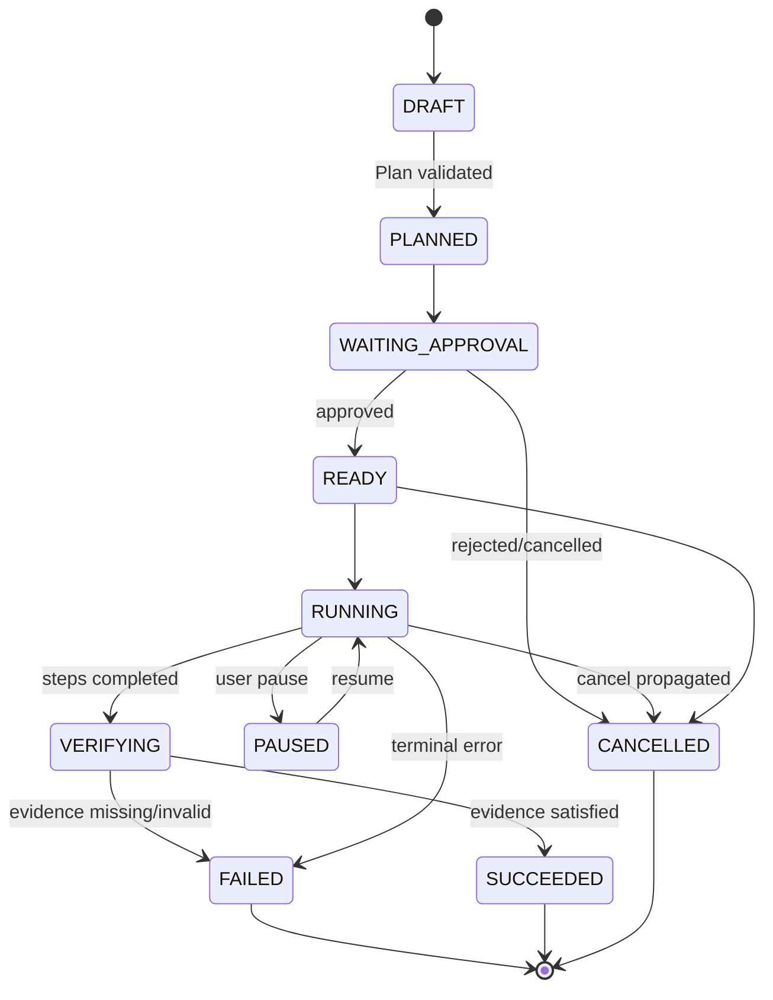
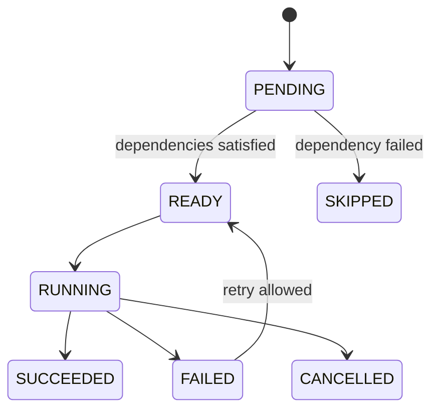
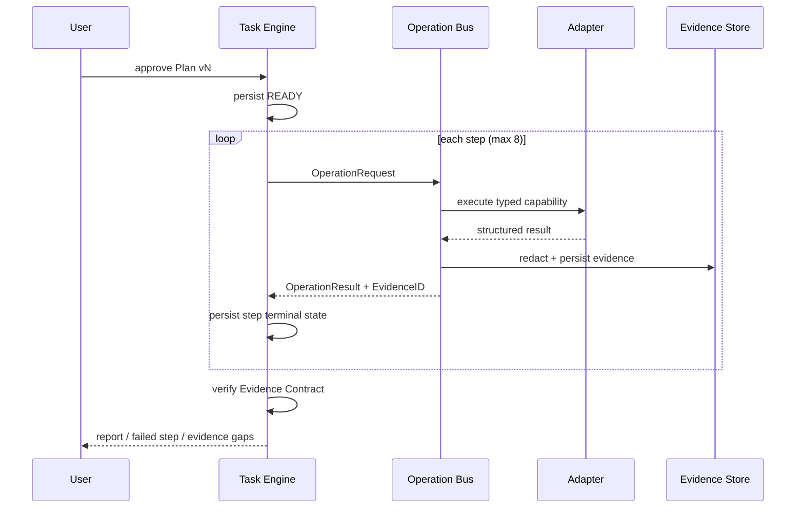

> 状态：已确认  
> 负责人：vvitem  
> 最后更新：2026-07-11  
> 基线 Commit：`b590887fea1e2c43e7831a48932b9be5d44ccfa3`  
> 关联 Milestone：`M3-safe-ai`  
> 关联 Issue/PR：待创建

# Task Engine

## Task 状态机

## TaskStep 状态机

## 执行时序

## 核心规则

- Plan 版本不可原地修改；用户编辑产生新版本。
- 最多 8 个步骤，依赖图必须无环。
- 每步定义 timeout、max output、retry policy、Evidence Contract。
- 默认重试 0；仅显式可重试的只读网络错误最多 2 次，指数退避。
- 取消先持久化 `CANCELLING` 意图（实现可选内部态），再传播 context；最终落 `CANCELLED`。
- 暂停只在步骤边界生效，避免半执行状态。
- 用户手工接管终端不会自动修改任务；可附加人工 Evidence 和注释。

## 重启恢复

启动时扫描非终态 Task：

- `READY`：可重新排队。
- `RUNNING` 且步骤有有效 Lease：等待 Lease 超时后按幂等规则恢复。
- 无法证明完成的步骤不得标记成功；转 `FAILED`，错误码 `RECOVERY_UNCERTAIN`。
- 任何 Task 最终必须进入可解释终态，禁止长期 `UNKNOWN`。

## Evidence Contract

每步至少声明 `type`、`required_fields`、`freshness`、`max_age`、`redaction_profile` 和可选验证表达式。`Verify` 只读取已持久化 Evidence，不重新扩展执行范围。
