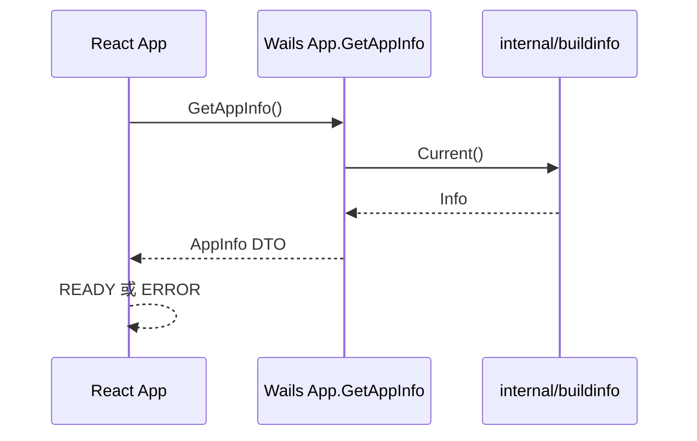

# M0-002 工程骨架设计

> 状态：待评审  
> 负责人：vvitem  
> 最后更新：2026-07-13  
> 基线 Commit：`197b63089c7b0c53b5a4c8cc6257ddbf68bb0e0e`  
> 关联 Milestone：`M0-foundation`  
> 关联 Issue/PR：[Issue #2](https://github.com/vvitem/item_all/issues/2)

## 1. 目标

建立 ItemAll 的最小可维护桌面工程骨架，使开发者能够在 Windows 本地完成：

1. 安装依赖并执行开发启动。
2. 编译 Go 后端和 React/TypeScript 前端。
3. 打开 Wails 桌面窗口。
4. 在页面中看到应用名称、版本、Commit、构建时间、Go Runtime 和运行状态。
5. 执行 Go 与前端基础测试。

本任务只建立工程底座，不实现 SSH、SFTP、数据库、AI、Operation Bus、SQLite 业务表、凭据存储或发布安装器。

## 2. 已确认工程身份

| 项目 | 值 |
|---|---|
| 产品名称 | `ItemAll` |
| 产品定位 | `Local-first SafeOps` |
| GitHub 仓库 | `github.com/vvitem/item_all` |
| Go Module | `github.com/vvitem/item_all` |
| Wails Application ID | `com.vvitem.itemall` |
| 首发平台 | Windows 正式支持 |
| 预览平台 | macOS、Linux 社区预览 |

## 3. 方案比较

### 3.1 方案 A：Wails 标准根目录结构

```text
item_all/
├── main.go
├── app.go
├── go.mod
├── go.sum
├── wails.json
├── build/
├── frontend/
└── internal/
    └── buildinfo/
```

优点：

- 与 Wails CLI 和官方模板的默认行为一致。
- `wails dev`、`wails build`、绑定生成和平台资源路径最直接。
- 对单人开发和 Codex 辅助最友好。
- 后续业务仍可全部收敛到 `internal/*`。

缺点：

- 根目录存在少量 Composition Root 文件。

### 3.2 方案 B：`cmd/desktop`

优点：符合大型 Go 多命令仓库习惯。

缺点：当前只有一个桌面应用，会增加 Wails CLI 路径、脚本和资源配置复杂度，没有即时收益。

### 3.3 方案 C：`apps/desktop` Monorepo

优点：便于未来同时维护桌面端、CLI、控制平面和 SDK。

缺点：六个月范围内这些产品都不建设，会引入不必要的工作区、构建和依赖管理复杂度。

### 3.4 选择

采用 **方案 A：Wails 标准根目录结构**。

原因：当前目标是单桌面应用、单人开发、快速形成可验证垂直切片。未来需要增加 CLI 时，可在不移动现有桌面 Composition Root 的前提下新增 `cmd/cli`，不需要现在预付 Monorepo 成本。

## 4. 目标目录结构

```text
item_all/
├── main.go                         # Wails 应用入口和 Composition Root
├── app.go                          # 最小 Wails Binding：GetAppInfo
├── go.mod
├── go.sum
├── wails.json
├── Makefile                        # 跨平台命令说明的统一入口；Windows 可直接使用底层命令
├── .gitignore
├── .nvmrc                          # Node 24 大版本
├── build/
│   ├── appicon.png                 # 临时应用图标，可由 Wails 模板生成
│   ├── darwin/
│   ├── linux/
│   └── windows/
├── frontend/
│   ├── index.html
│   ├── package.json
│   ├── pnpm-lock.yaml
│   ├── tsconfig.json
│   ├── tsconfig.node.json
│   ├── vite.config.ts
│   ├── src/
│   │   ├── App.tsx
│   │   ├── App.test.tsx
│   │   ├── main.tsx
│   │   ├── styles.css
│   │   └── types.ts
│   └── wailsjs/                    # Wails 自动生成绑定，不手工编辑
└── internal/
    └── buildinfo/
        ├── info.go
        └── info_test.go
```

约束：

- `main.go` 只负责应用装配，不承载业务规则。
- `app.go` 只负责 DTO 转换和 Wails Binding。
- 构建元数据逻辑放在 `internal/buildinfo`。
- 不提前创建 `asset`、`operation`、`task`、`database`、`ssh` 等空包。
- 不创建只有目录和占位注释的空模块。

## 5. 技术版本策略

| 技术 | 策略 |
|---|---|
| Go | `go 1.26`；开发基线使用 Go 1.26.x 稳定补丁版本 |
| Wails | 固定 `github.com/wailsapp/wails/v2` 的 v2.13.x 精确版本 |
| Node.js | Node 24 LTS，大版本由 `.nvmrc` 固定 |
| pnpm | pnpm 11.x，`packageManager` 写入精确版本 |
| React | 使用脚手架生成时的稳定精确版本并提交锁文件 |
| TypeScript | 精确版本写入 `devDependencies` |
| Vite | 精确版本写入 `devDependencies` |
| Vitest | 精确版本写入 `devDependencies` |

版本规则：

1. `go.mod`、`package.json` 和 `pnpm-lock.yaml` 必须提交。
2. 禁止在项目配置中使用 `latest`、`*` 或无上限范围。
3. CLI 安装说明可引用具体版本；不得要求开发者长期追随 `@latest`。
4. 依赖升级由独立 PR 完成，不与功能 PR 混合。

## 6. 后端设计

### 6.1 `internal/buildinfo`

负责提供不可变应用构建信息：

```go
type Info struct {
    Name      string `json:"name"`
    Version   string `json:"version"`
    Commit    string `json:"commit"`
    BuildTime string `json:"buildTime"`
    GoVersion string `json:"goVersion"`
    OS        string `json:"os"`
    Arch      string `json:"arch"`
}
```

默认值：

- `Name`: `ItemAll`
- `Version`: `dev`
- `Commit`: `unknown`
- `BuildTime`: `unknown`
- `GoVersion`: 运行时读取
- `OS`/`Arch`: 运行时读取

`Version`、`Commit` 和 `BuildTime` 通过 `-ldflags -X` 注入。开发模式没有注入时必须返回稳定默认值，不能报错或返回空字符串。

### 6.2 `App` Binding

只公开一个方法：

```go
func (a *App) GetAppInfo() AppInfo
```

`AppInfo` 是面向前端的 DTO：

```go
type AppInfo struct {
    Name      string `json:"name"`
    Tagline   string `json:"tagline"`
    Version   string `json:"version"`
    Commit    string `json:"commit"`
    BuildTime string `json:"buildTime"`
    Runtime   string `json:"runtime"`
    Status    string `json:"status"`
}
```

固定值：

- `Tagline`: `Local-first SafeOps`
- `Status`: `ready`

M0-002 不增加健康检查、文件系统访问、环境变量读取或网络请求。

## 7. 前端设计

### 7.1 页面内容

单页只展示：

- ItemAll
- Local-first SafeOps
- 应用运行状态
- Version
- Commit
- Build Time
- Go Runtime / OS / Arch

### 7.2 状态模型

前端只有三种显示状态：

```text
LOADING → READY
LOADING → ERROR
```

- `LOADING`：等待 `GetAppInfo()`。
- `READY`：成功显示全部元数据。
- `ERROR`：显示用户可理解的错误和“重新读取”按钮。

不引入路由器、全局状态库、请求缓存库、组件库或 Tailwind。

### 7.3 错误处理

- 捕获 Wails Binding 调用异常。
- 页面不得无限停留在 Loading。
- UI 只显示安全的通用错误，不展示堆栈、路径或环境变量。
- 详细异常仅在开发控制台中记录；M0-002 不建设持久日志系统。

## 8. 数据流



该数据流是只读的，不经过 Operation Bus。原因是构建元数据查询不属于资产操作、远程执行或持久化业务行为。Operation Bus 从 `M0-007` 开始成为所有运维能力的唯一执行入口。

## 9. Wails 配置

`wails.json` 至少固定：

- `name`: `ItemAll`
- `outputfilename`: `ItemAll`
- `frontend:install`: `pnpm install --frozen-lockfile`
- `frontend:build`: `pnpm build`
- `frontend:dev:watcher`: `pnpm dev`
- Application ID：`com.vvitem.itemall`

窗口设计保持最小：

- 默认宽度约 1024。
- 默认高度约 700。
- 最小宽高防止内容完全不可用。
- 不实现自定义无边框窗口、托盘、开机启动或多窗口。

## 10. 开发与构建命令

必须支持以下可复现命令：

```text
go test ./...
cd frontend && pnpm install --frozen-lockfile
cd frontend && pnpm typecheck
cd frontend && pnpm lint
cd frontend && pnpm test --run
cd frontend && pnpm build
wails dev
wails build
```

`Makefile` 只提供常用命令别名，不得成为唯一可运行入口。Windows 用户即使没有 `make`，也能按 README 中的底层命令完成开发和验证。

## 11. 测试设计

### 11.1 Go 单元测试

`internal/buildinfo/info_test.go` 至少验证：

- 无 ldflags 时返回稳定默认值。
- Name 永远为 `ItemAll`。
- Version、Commit、BuildTime 不为空。
- Runtime 包含有效 Go 版本、OS 和 Arch。

### 11.2 前端单元测试

`App.test.tsx` 至少验证：

- 初始显示 Loading。
- Binding 成功时展示 ItemAll 和版本信息。
- Binding 失败时显示错误状态。
- 点击重新读取后再次调用 Binding。

### 11.3 构建验证

- `go test ./...` 成功。
- 前端 typecheck、lint、test、build 成功。
- `wails build` 能完成 Windows 构建。
- Windows 真机运行后显示完整 AppInfo。

M0-002 只记录本地验证步骤；GitHub Actions 门禁属于 `M0-003`。

## 12. 安全边界

- 不读取或显示环境变量。
- 不引入 Token、API Key、凭据示例或 `.env`。
- 不访问网络。
- 不持久化任何用户数据。
- 不加载远程脚本、远程字体或 CDN 资源。
- 前端错误不得包含本地绝对路径和堆栈。
- 锁文件必须提交，降低供应链漂移。

## 13. 明确不做

- SSH、SFTP、Terminal。
- MySQL、PostgreSQL、SQLite 业务表。
- Operation Bus、Policy、Task Engine、Audit、Evidence。
- AI Provider、Plan、Runbook。
- Router、状态管理库、UI 组件库。
- 自动更新、安装器优化、代码签名。
- macOS/Linux 专项适配。
- 云服务、账号、控制平面、遥测。

## 14. 验收标准

`M0-002` 只有同时满足以下条件才能完成：

1. 工程身份与本设计一致。
2. 根目录使用 Wails 标准结构。
3. Windows 本地 `wails dev` 可启动。
4. Windows `wails build` 可生成可运行应用。
5. 页面可展示全部 AppInfo。
6. Loading、Ready、Error 三种状态可验证。
7. Go 与前端测试、类型检查、Lint、生产构建全部通过。
8. 所有依赖均有精确版本或锁文件证据。
9. 不包含任何范围外业务能力。
10. 同步更新项目进度文档，并关联实现 PR、Commit 和验证记录。

## 15. 后续衔接

完成 `M0-002` 后按顺序执行：

1. `M0-003`：建立 Go/前端测试、Windows Build 和 Secret Scan 的 CI 门禁。
2. `M0-004`：建立 SQLite WAL、Migration 和 Repository 骨架。
3. `M0-006`：完成 Windows Credential Manager PoC。
4. `M0-007`：实现 Operation Bus 接口和假 Adapter。

在 `M0-003` 完成前，不开始 SSH、数据库或 AI 功能开发。
